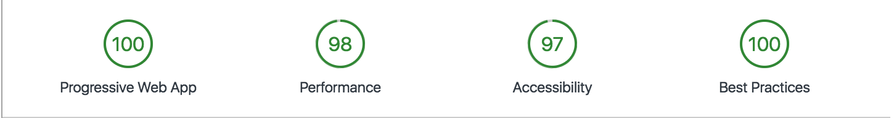
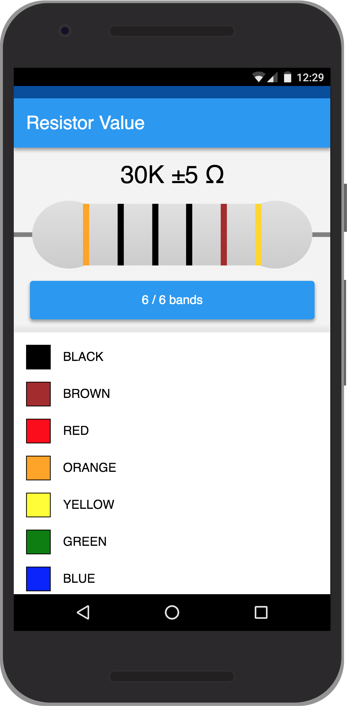

# ResistorValue

A PWA for calculating electrical resistor values.
a

## Development server

Run `npm start` for a dev server. Navigate to `http://localhost:8080/`. The app will automatically
reload if you change any of the source files.

## Build

Run `npm run build` to build the project. The build artifacts will be stored in the `dist/`

## Running unit tests

Run `npm test` to execute the unit tests via [Karma](https://karma-runner.github.io).
